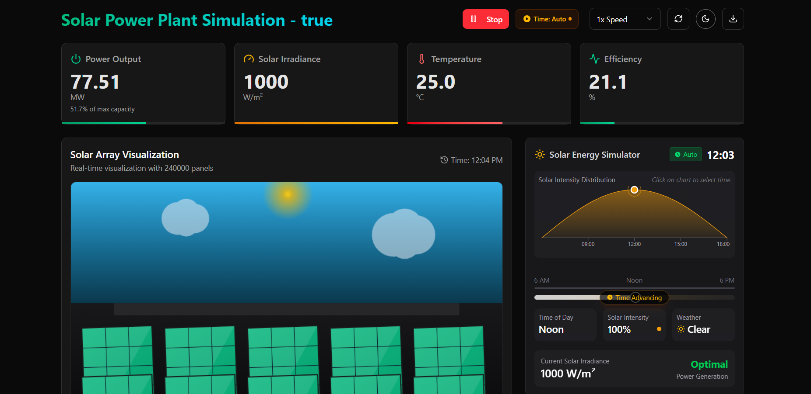
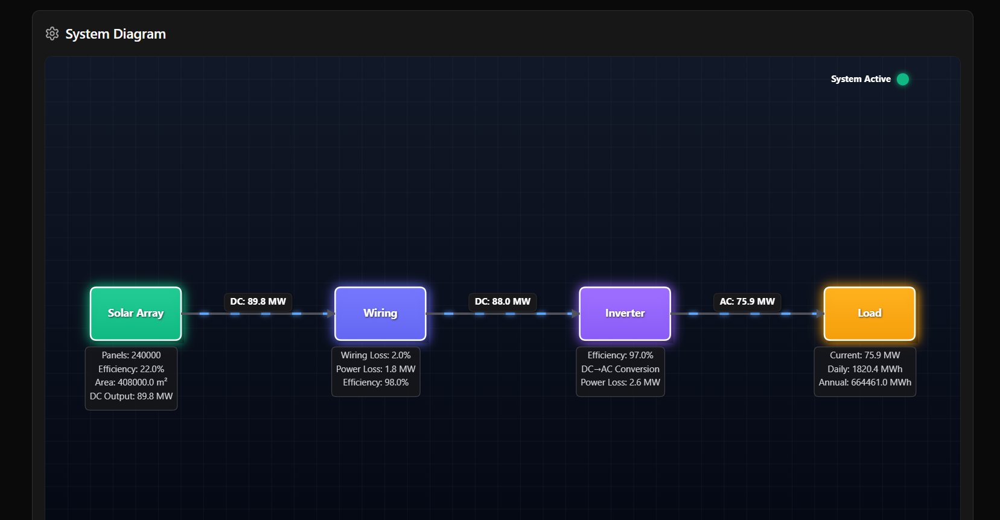
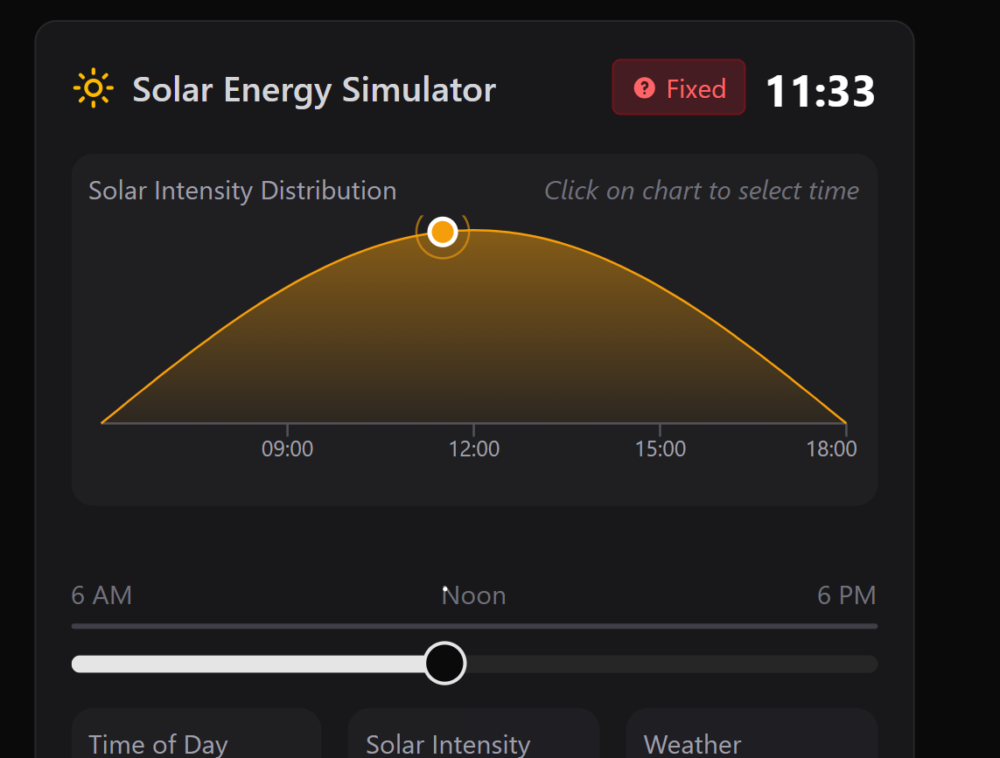

# SolarSims - Solar Power Plant Simulator

SolarSims is a comprehensive web-based simulator for a large-scale solar power plant, providing an interactive interface to visualize, control, and monitor solar power generation in real-time with dynamic environmental conditions.

> This project demonstrates a sophisticated simulation of solar power generation with realistic physics and environmental factors affecting energy production. This was was part of a school project.



## Features

### 1. Real-time Solar Output Simulation

- Physically accurate modeling of solar panel performance based on sun position, time of day, and weather
- Dynamic power generation calculations with realistic efficiency factors
- Accurate representation of DC to AC power conversion through system components

### 2. Comprehensive System Visualization

- Interactive system diagram showing power flow from solar array through wiring and inverter to load
- Animated power flow with real-time metrics at each conversion stage
- Visual representation of losses and efficiencies throughout the system

### 3. Environmental Factor Modeling

- Sun intensity changes throughout the day following realistic patterns
- Weather effects including cloud cover, temperature, and dust accumulation
- Wind speed effects on panel cooling and efficiency

### 4. Advanced Control Options

- Manual or automatic time progression controls
- Adjustable simulation speed from real-time to accelerated time
- Interactive time-of-day slider with solar intensity curve

### 5. System Configuration

- Configurable solar array parameters (panel count, efficiency, angle)
- Support for fixed panels or sun-tracking systems
- Adjustable inverter efficiency and wiring losses

### 6. Monitoring Dashboards

- Real-time graphs showing power output and system efficiency
- Historical data tracking and visualization
- Comprehensive metrics display with key performance indicators

### 7. Weather Patterns

- Preset weather conditions (sunny, cloudy, rainy, windy, hot)
- See immediate impact of changing conditions on power output

### 8. System Status Tracking

- Battery charge monitoring
- Temperature and dust accumulation alerts
- Comprehensive energy production statistics

## Tech Stack

- React with TypeScript for UI components
- Tailwind CSS and shadcn/ui for styling
- Zustand for state management
- Canvas API for interactive visualizations
- Recharts for data visualization

## Getting Started

### Prerequisites

- Node.js (v18.x or higher)
- npm, yarn, or pnpm

### Installation

#### Install dependencies using your package manager of choice

```bash
npm install
```

#### Start the development server

```bash
npm run dev
```

### Usage

The simulator provides a comprehensive interface to:

1. Start/Stop the simulation
2. Control time advancement (automatic or manual)
3. Adjust parameters like panel count, efficiency, and orientation
4. Monitor real-time data on power output, energy production, and system efficiency
5. Visualize power flow through the system diagram
6. Apply different weather patterns and see their effects
7. Export simulation data for further analysis

#### System Diagram with Power Flow



#### Solar Intensity Simulation



## Future Enhancements

- Economic analysis tools (ROI, LCOE)
- Geographic location selection with appropriate sun paths
- Seasonal variations in solar patterns
- Grid integration simulation
- Detailed component failure analysis
